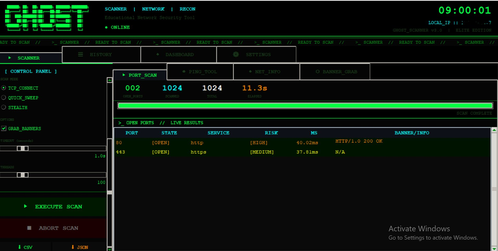
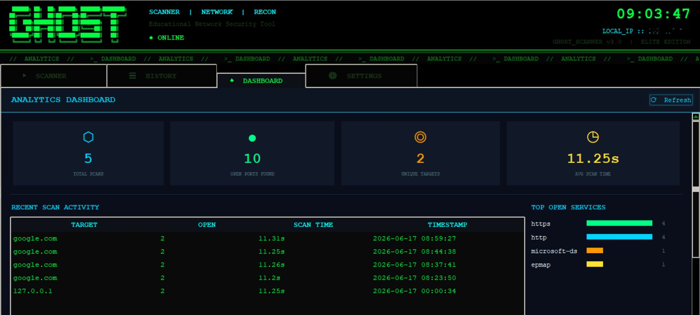
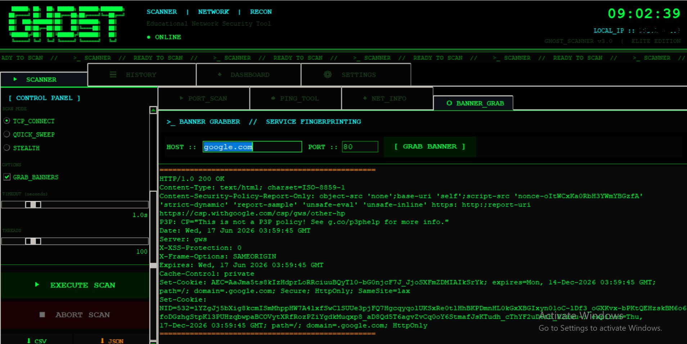
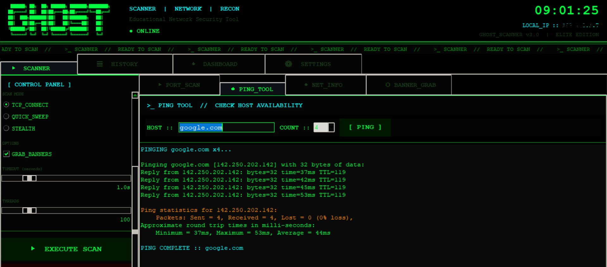

# ◈ GHOST_SCANNER (PortScannerPro v3.0)

**Elite Network Reconnaissance & Port Scanning Framework**  
*Final Term Project — Open Source Software Development (OSSD) · CLO4*

---

📌 Project Description

GHOST_SCANNER is a full-featured, GUI-based network security toolkit built entirely in Python with Tkinter. Designed with a Matrix-inspired hacker terminal aesthetic, it goes beyond a basic port scanner to deliver a complete reconnaissance suite — port scanning, ping diagnostics, network intelligence, and banner grabbing — all wrapped in a live, real-time terminal-style interface.

---

 ✨ Features

| Feature | Description |
|---|---|
| **Multi-threaded Port Scanner** | Scans hundreds of ports concurrently using `ThreadPoolExecutor` |
| **Service Detection** | Identifies 70+ services by port number |
| **Banner Grabbing Tool** | Dedicated module to fingerprint any service on any port |
| **Ping Diagnostics Tool** | Built-in ICMP ping utility with live terminal-style output |
| **Network Info Module** | Displays hostname, local IP, external IP, and DNS resolution checks |
| **Risk Assessment** | Color-codes ports as Critical / High / Medium / Low / Info |
| **Live Results** | Results stream in real time as ports are discovered |
| **Scan History** | All scans stored in SQLite; browse and replay anytime |
| **Analytics Dashboard** | KPI cards, bar charts, top open services frequency analysis |
| **Export to CSV/JSON** | One-click export of scan results |
| **Saved Targets** | Save frequently scanned hosts for quick access |
| **Elite Hacker UI** | Matrix-green terminal theme, ASCII art banner, live clock, scrolling ticker |

---

🖥️ Screenshots
 Analytics Dashboard


### Port Scanner — Live Results


### Ping Diagnostics Tool


### Banner Grabber — Service Fingerprinting


---

## 🛠️ Technologies Used

| Category | Technology |
|---|---|
| Language | Python 3.8+ |
| GUI Framework | Tkinter (ttk + tk) |
| Database | SQLite3 (built-in) |
| Concurrency | `concurrent.futures.ThreadPoolExecutor`, `threading` |
| Networking | `socket`, `subprocess` (standard library) |
| Version Control | Git + GitHub |

**No external dependencies required!** Everything uses Python's standard library.

---

## ⚙️ Setup & Running

### Prerequisites
- Python 3.8 or newer
- No pip installs needed (all standard library)

### Clone & Run
```bash
git clone https://github.com/bellatorsaleh/PortScannerPro.git
cd PortScannerPro
python main.py
```

### Project Structure
```
PortScannerPro/
├── main.py                  # Entry point
├── README.md
├── requirements.txt
├── GITHUB_WORKFLOW.md        # Full Git workflow guide
├── data/                     # SQLite database (auto-created)
│   └── portscanner.db
├── assets/                   # Screenshots
│   ├── screenshot_dashboard.png
│   ├── screenshot_port_scan.png
│   ├── screenshot_ping_tool.png
│   └── screenshot_banner_grab.png
└── modules/
    ├── __init__.py
    ├── database.py            # SQLite data layer
    ├── scanner.py              # Core scanning engine
    ├── main_window.py          # Root window + elite theme
    ├── scan_tab.py              # 🖥 Screen 1: Scanner + Ping + NetInfo + Banner Grab
    ├── history_tab.py           # 🖥 Screen 2: History
    ├── dashboard_tab.py         # 🖥 Screen 3: Dashboard
    └── settings_tab.py          # 🖥 Screen 4: Settings
```

---

## 🗺️ Application Screens

### Screen 1 — Scanner (with 4 internal tools)
- **Port Scan** — target input, presets, custom range, live results table with risk coloring
- **Ping Tool** — ICMP ping with configurable packet count, live terminal output
- **Net Info** — hostname, local/external IP, DNS resolution checks for common hosts
- **Banner Grab** — connect to any host:port and capture the raw service banner
- Export to CSV and JSON
- Live terminal-style scan log

### Screen 2 — History Tab
- Master-detail view: sessions → open ports
- Delete sessions from history
- View banner grabs from past scans

### Screen 3 — Dashboard Tab
- 4 KPI cards: total scans, open ports found, unique targets, avg scan time
- Recent activity table (last 20 scans)
- Top open services bar chart

### Screen 4 — Settings Tab
- Persist default timeout, threads, banner options
- Saved Targets manager (add/delete hosts)
- About info

---

## 🌐 GitHub Workflow

- **Branching strategy:** `main` → feature branches per member
- **PRs required** for all merges into `main`
- **Issues** used for task tracking

### Branches
| Branch | Owner | Feature |
|---|---|---|
| `feature/scanner-core` | Syed Ali Saleh Abbas Naqvi | Core scanning engine, database, splash screen |
| `feature/scan-tab` | Muhammad Ahmad Asim | Main window, scan tab, ping/netinfo/banner tools |
| `feature/history-dashboard` | Muhammad Ali Inam | History tab, dashboard tab, settings tab |

See [GITHUB_WORKFLOW.md](GITHUB_WORKFLOW.md) for the complete step-by-step Git guide.

---

## 👥 Team Contributions

| Member | Role | Contributions |
|---|---|---|
| **Syed Ali Saleh Abbas Naqvi** | Group Lead | Project planning, repository setup, scanner engine, database module, README |
| **Muhammad Ahmad Asim** | Developer | Main window, elite hacker UI theme, scan tab, ping/net-info/banner-grab tools, export features |
| **Muhammad Ali Inam** | Developer | History tab, analytics dashboard, settings tab |

---

## 🔗 Links

- Repository: `https://github.com/bellatorsaleh/PortScannerPro`
- Issues: `https://github.com/bellatorsaleh/PortScannerPro/issues`
- Pull Requests: `https://github.com/bellatorsaleh/PortScannerPro/pulls`

---

## ⚠️ Disclaimer

This tool is built for **educational purposes** as part of a university project.  
Only scan systems you own or have explicit written permission to test.

---

## 📄 License

MIT License — Open Source. See `LICENSE` file.
